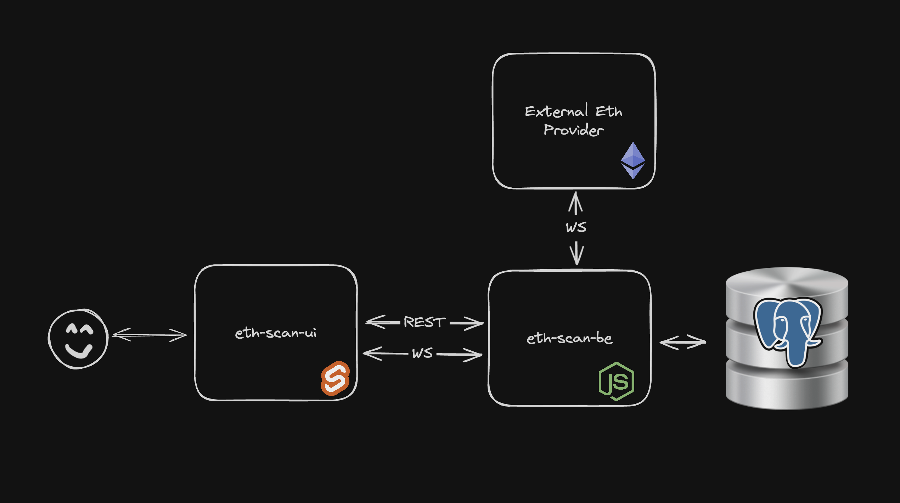
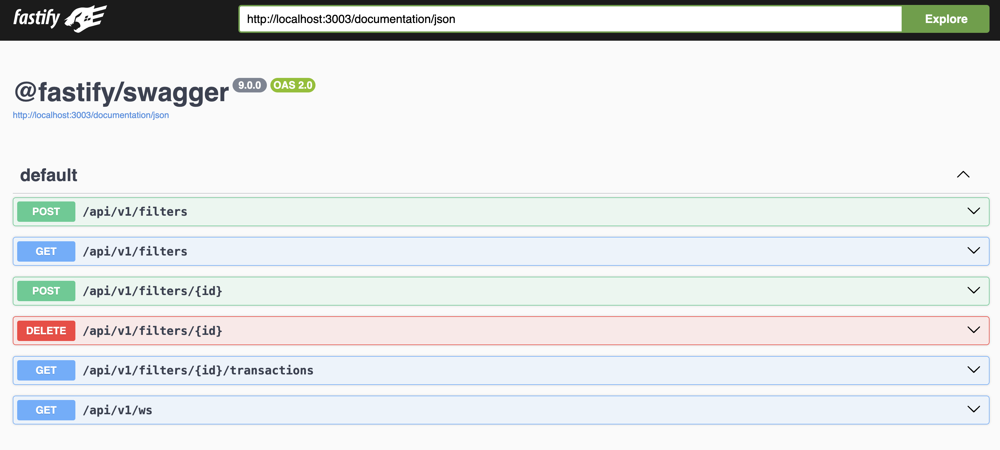
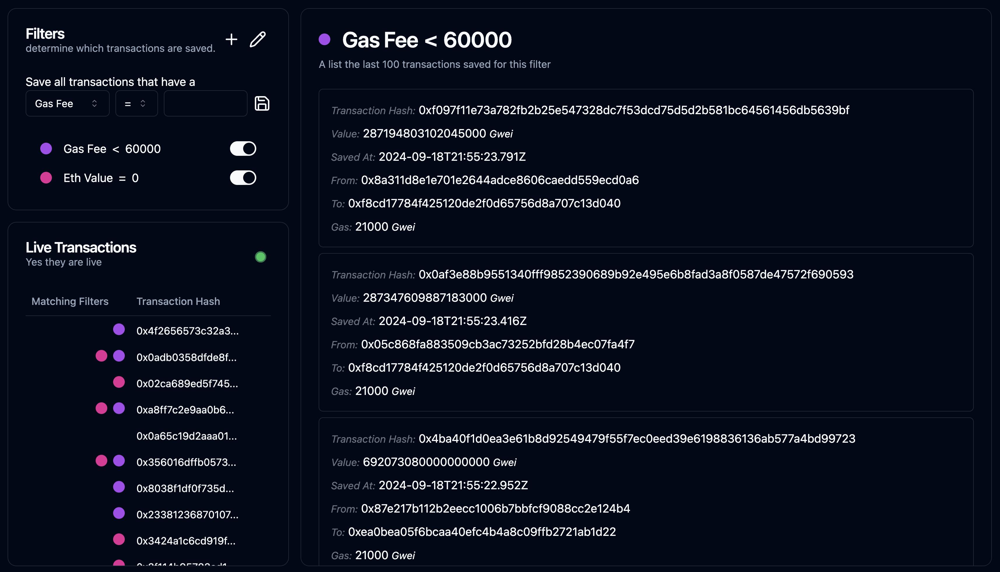

# EthScan, a live ETH transaction scanner

This is a simple app that allows you to monitor ETH transactions in real-time. As well as save said transactions based on real-time, configurable filters.

This app has been made as part of a technical interview by Nexo, following a given task.

The app comes in a monorepo and is composed of:

- `eth-scan-be` The Node.js backend, responsible for transaction monitoring and filter management
- `eth-scan-ui` A simple UI, written in Sveltekit, that allows you to interact with the backend

A sort-of comprehensive worklist can be found in the [docs/DONE.md](./docs/DONE.md) file.

## Architecture

### High level architecture



### Technical stack and reasoning

#### `eth-scan-be`

- `Node.js` runtime
- `TypeScript` because it makes the code more readable and maintainable
- `vite-node` as a transformer. Used for its OOB support for ESM, `TypeScript`, Testing suite
- `Fastify` as a web framework. Used for its performance and minimalism, and excellent ecosystem. Generates complete swagger documentation automatically with the help of `zod`. Used for creating a **REST API**, as well as a **websocket server**.
- `Zod` as a request and .env validator. Used because of it's concise syntax, tight `TypeScript` integration
- `PostgreSQL` as a database. General purpose, and a good fit for the task at hand. Supports RLS and schemas, which are used to achieve **data segregation** in the future
- `DrizzleORM` as an ORM. Used for its query builder, superb `TypeScript` integration, migration support, outstanding DB explorer. Works great with `zod` for model validation.
- `vitest` as a testing framework. Used for its performance and minimalism. works great with `vite-node`
- `web3` as a Ethereum provider. Used because of it's simple API.
- `web-sockets` used to relay real-time transaction data to the UI
- `docker` used to simplify the DB provisioning

#### `eth-scan-ui`

- `SvelteKit` as a frontend framework. Used for its simplicity, speed of development.
- `Tailwind` as a CSS framework. Used for speed of development.
- `Zod` for .env validation
- `shadcn-svelte` minimalistic ui library
- `lucide-svelte` clean, modern icons

## Running Locally

### Prerequisites

- Node.js: `^22.6.0`
  - If you have `nvm` you can run `nvm use` to install and use the correct version of node
- Docker: `^25.0.0`
  - Docker is used to simplify the DB provisioning

### Installation

From the root of the repo, run:

```sh
npm install
```

This does several things:

1. Installs dependencies for `eth-scan-ui`
1. Installs dependencies for `eth-scan-be`
1. Sets up the Postgres DB via `docker`

### Running

Normally you would have to populate .env files for both projects, but I have left them into git for ease of use. No sensitive information, API keys, is stored in those files as of now.

We can now run the app:

- In a single terminal instance

```sh
npm run start
```

- Or in two terminal instances (recommended for easier log reading)

```sh
npm run start:be
```

```sh
npm run start:ui
```

### Interacting with the app

Now that the app is running we can interact with it!

The BE will be running on port `3003`, and it's interactive API documentation, available on http://localhost:3003/documentation


The UI will be running on http://localhost:5173


### Running the tests

Currently there are tests for the `eth-scan-be` project.
From the `eth-scan-be` directory, run:

```sh
npm run test
```

## Next steps

I had a blast working on this! Seeing the transactions come in real-time and respond to the filters is really satisfying 🙌

But no project is ever really complete, and this one is no exception.

So here are some ideas for the next steps:

- Auth: add authentication and authorization
- [Data segregation](https://www.nextlabs.com/why-is-data-segregation-important/#:~:text=Data%20segregation%2C%20or%20data%20separation,access%20rights%2C%20or%20regulatory%20requirements):
  - possibly add RLS on DB level
  - possibly add different schemas for each user
  - A lot could be done here depending on the exact requirements
- Add more tests: unit, integration and E2E
- Dockerize BE, UI and DB, for use with docker-compose
- Extract overlapping types and logic into a shared lib inside the monorepo (mostly API types)
- Add more transaction filters
- Revisit logs
- Improve service uptime by adding redundancy
- Setup CI/CD
